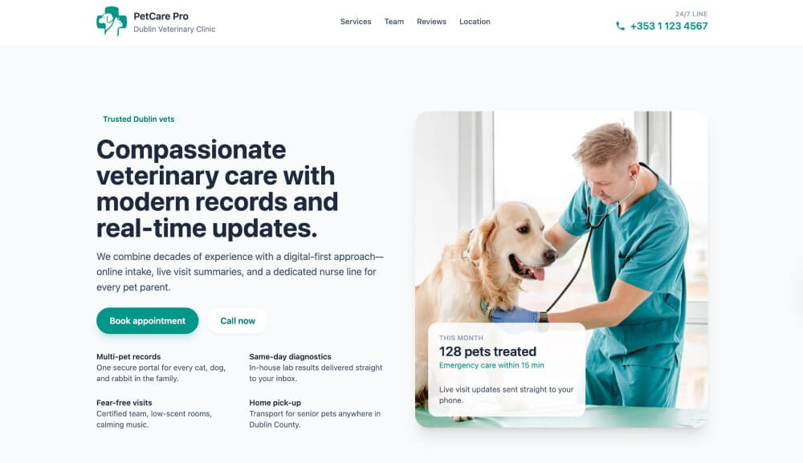
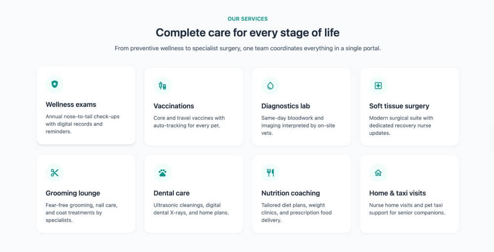
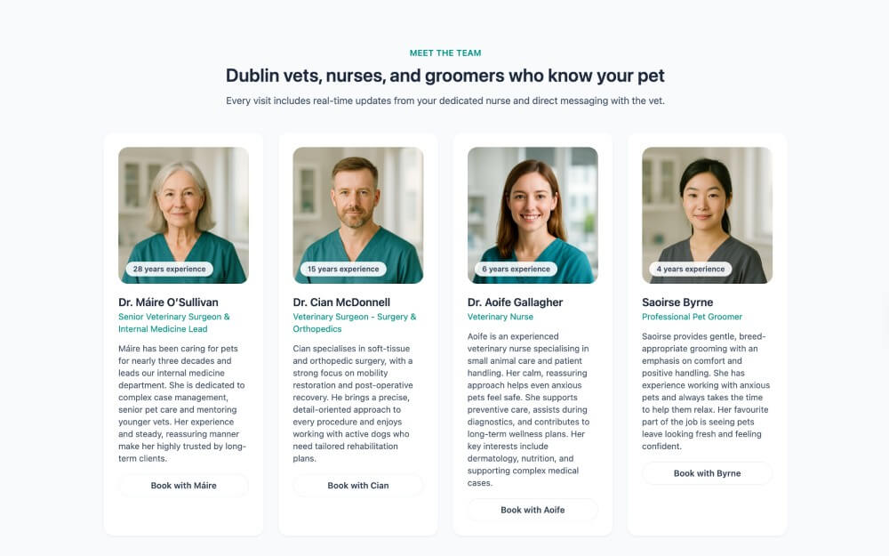
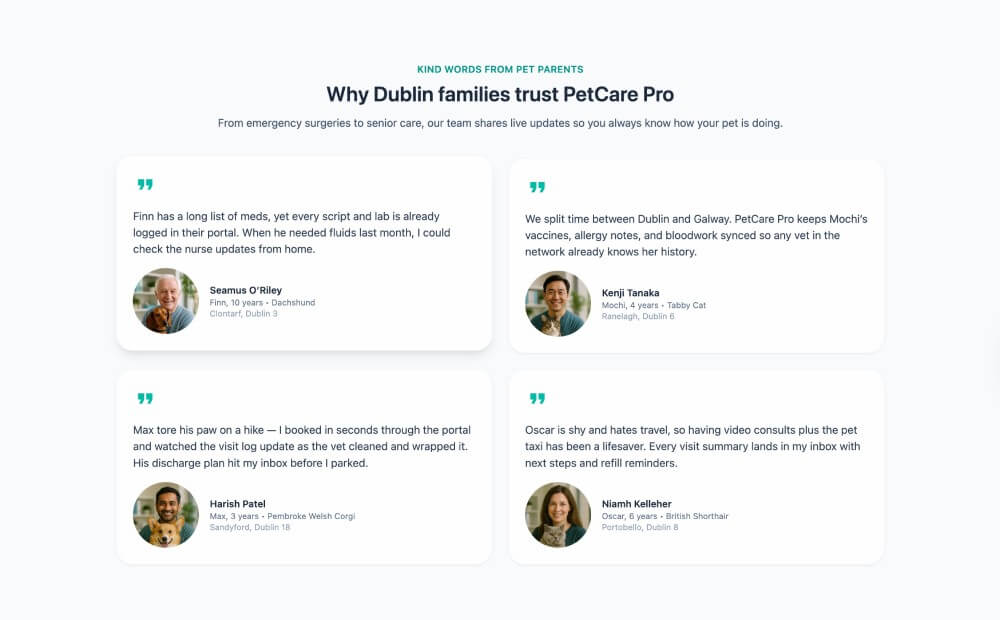
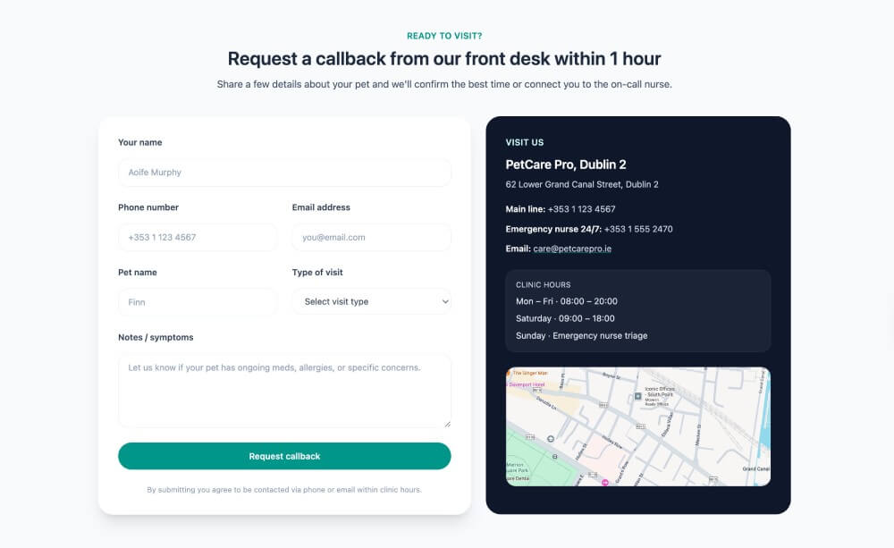
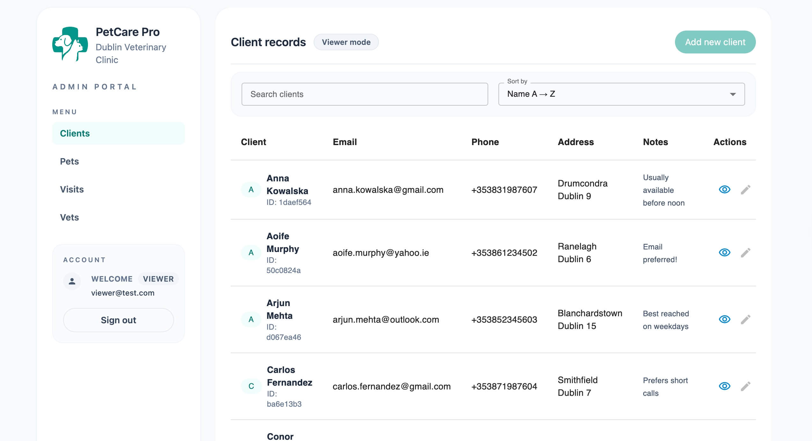

# PetCare Pro 🐾

PetCare Pro is a personal pet project focused on building a small veterinary clinic management system with a public-facing website and an internal admin area.

- Live demo: [https://pet-care-pro-portal.vercel.app/](https://pet-care-pro-portal.vercel.app/)

> Public-facing part of the application. The admin area is under active development.

    
    
     
   
    
    
    

It is designed as a CRUD-based system for managing clients, pets, clinic visits, and staff, with an emphasis on clean architecture, type safety, and real-world data relationships.

The UI and overall interface design were created by me, with a focus on usability and clarity for both public pages and admin workflows, based on my previous experience building web applications.

##The app is divided into two main parts:##

### Public area

- Clinic landing page
- Services overview (veterinary care, grooming, vaccinations)
- Contact information

### Admin area

- Client management
- Pet profiles linked to owners
- Visit records (reason, status, diagnosis, treatment, invoice)
- Staff management (vets, nurses, groomers)

## Tech Stack

- React
- TypeScript
- React Router
- Tailwind CSS
- Supabase (PostgreSQL, Auth, RLS)
- TanStack Query
- React Hook Form + Zod

## Project Status

The project is currently in progress.  
Features and UI are being implemented incrementally.

## Planned Improvements

- Authentication and role-based access
- Dedicated client and pet pages with visit history
- Improved navigation between related entities
- Filtering and search in admin tables
- Improved UX (loading and empty states)
- Basic analytics and dashboards

## Database Schema

The application uses a relational PostgreSQL database powered by Supabase.

### `clients`

- `id`
- `created_at`
- `full_name`
- `email`
- `phone`
- `address`
- `notes`

Stores client contact information and additional notes.

---

### `pets`

- `id`
- `created_at`
- `name`
- `species`
- `breed`
- `sex`
- `microchip`
- `notes`
- `birth_date`
- `weight_kg`
- `owner_id`

Represents pets owned by clients.  
Each pet is linked to a client via `owner_id`.

---

### `visits`

- `id`
- `created_at`
- `pet_id`
- `visit_date`
- `reason`
- `status`
- `diagnosis`
- `invoice_amount`
- `treatment`
- `notes`
- `vet_id`

Stores clinic visits, including medical details, visit status, and billing information.  
Each visit is linked to a pet and a staff member.

---

### `vets`

- `id`
- `created_at`
- `full_name`
- `role`
- `years_experience`
- `notes`
- `is_active`

Stores clinic staff information such as veterinarians, nurses, and groomers.
