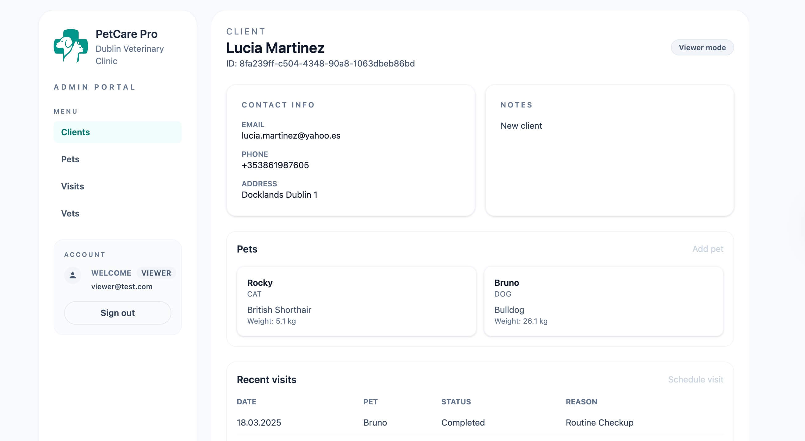
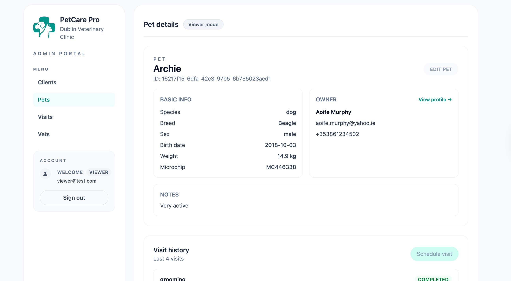

# PetCare Pro 🐾

PetCare Pro is a full-stack application for a veterinary clinic: a marketing website for pet owners plus an internal admin panel that manages clients, pets, visits and staff. The goal is to build a realistic CRUD-heavy business app with Supabase as the backend and to polish a clean, consistent UI.

- **Live demo:** [https://pet-care-pro-portal.vercel.app](https://pet-care-pro-portal.vercel.app)
- **Admin (viewer) access:** [https://pet-care-pro-portal.vercel.app/login](https://pet-care-pro-portal.vercel.app/login)

  Demo viewer account: `viewer@test.com / pass12345` (read-only mode; buttons for add/edit/delete are disabled).

  An admin role with full CRUD access is available on request.

<p align="center">
  
  
  
  <br />
  
  
  
  <br>


</p>

The project is completely self–designed: layout, typography, and system of cards/dialogs were created from scratch to keep both landing and back-office consistent. All data structures mirror a real relational database: clients own pets, pets have visits, visits are assigned to vets, etc.

## Application structure

### Public landing

- Hero, services, testimonials, team.
- Contact form (React Hook Form + Zod) with async validation.
- CTA button that leads to the admin login page.

### Admin portal

- **Clients** – list, add/edit/delete, detail pages with linked pets & visits, plus shortcuts to add a new pet or schedule a visit directly for the owner.
- **Pets** – table, create/edit dialogs, owner selector, and quick actions to view owner or open the pet detail page.
- **Pet detail pages** – show medical data and history, allow updating the pet or scheduling a visit in one click.
- **Visits** – track status/reason/diagnosis/treatment/invoice, link to pet + vet; detail view highlights both entities.
- **Vets** – staff roster with active flag and years of experience.
- **Role-aware UI** – buttons/inputs are disabled for Viewer accounts, and the header shows the logged-in user + role badge.
- **Forms** – all dialogs share RHF + Zod + custom input components.
- **Tables** – manual pagination, search/filter (clients, pets, visits) powered by Supabase range queries.

## Tech stack

- **Frontend:** React 19, Vite, TypeScript, Tailwind CSS, MUI table components for admin lists and dialogs.
- **Data fetching:** React Router + TanStack Query.
- **Forms/validation:** React Hook Form + Zod (schemas reused in tests).
- **Backend:** Supabase (PostgreSQL + Auth + Row Level Security).
- **State:** minimal local state; server state handled with TanStack Query.
- **Testing:** Vitest + @testing-library/react, schema unit tests already in place.

## Getting started

```bash
git clone https://github.com/ilona-web-dev/pet-care-pro.git
cd pet-care-pro
npm install
npm run dev        # launches Vite dev server on http://localhost:5173
npm test           # runs Vitest test suite
```

### Environment variables

Create `.env` at the repo root:

```
VITE_SUPABASE_URL=https://your-project.supabase.co
VITE_SUPABASE_ANON_KEY=public-anon-key
```

_Important:_ Supabase env vars should be without quotes. The client lives in `src/lib/supabaseClient.ts`.

### Supabase setup (quick version)

1. Create a new Supabase project and enable **Row Level Security**.
2. Create the tables listed below (snake_case columns).
3. Add a `user_roles` table with columns:
   - `user_id uuid references auth.users`
   - `role text` (`admin` or `viewer`)
4. Seed demo data or import from CSV (see `/docs` screenshots for reference).
5. Policies:
   - `SELECT` for authenticated users on all tables.
   - `INSERT/UPDATE/DELETE` only when the current user has `role = 'admin'` in `user_roles`.

## Testing

Schemas share a single source of truth with forms. Tests live in `src/formSchema/*.test.ts` and can be extended to other components.

```bash
npm test
npx vitest run src/formSchema/vetSchema.test.ts   # run a single suite
```

## Roadmap

- [x] Public landing + contact simulation
- [x] CRUD for clients, pets, visits, vets
- [x] Detail pages with cross-links
- [x] Pagination + search/filter
- [x] Viewer-vs-Admin UI state + Supabase RLS
- [x] Zod schemas + Vitest
- [x] Toast-driven CRUD confirmation dialogs (edit/delete)
- [ ] Dashboard metrics

## Database schema

The application uses a relational PostgreSQL database powered by Supabase.

### `clients`

- `id`
- `created_at`
- `full_name`
- `email`
- `phone`
- `address`
- `notes`

Stores client contact information and additional notes.

---

### `pets`

- `id`
- `created_at`
- `name`
- `species`
- `breed`
- `sex`
- `microchip`
- `notes`
- `birth_date`
- `weight_kg`
- `owner_id`

Represents pets owned by clients.  
Each pet is linked to a client via `owner_id`.

---

### `visits`

- `id`
- `created_at`
- `pet_id`
- `visit_date`
- `reason`
- `status`
- `diagnosis`
- `invoice_amount`
- `treatment`
- `notes`
- `vet_id`

Stores clinic visits, including medical details, visit status, and billing information.  
Each visit is linked to a pet and a staff member.

---

### `vets`

- `id`
- `created_at`
- `full_name`
- `role`
- `years_experience`
- `notes`
- `is_active`

Stores clinic staff information such as veterinarians, nurses, and groomers.
